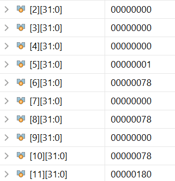

# Single_Cycle_RISCV
A fully functional single-cycle RISC-V processor implementing the **RV32I** base integer instruction set.
Written in Verilog, this project is built for clarity, modularity — ideal for exploring CPU microarchitecture and digital design fundamentals.

---

##  Features

- Single-cycle CPU architecture
- Supports RV32I instruction set
- Instruction fetch, decode, execute, memory, and write-back handled in one clock cycle
- Modular Verilog design (ALU, control unit, register file, etc.)
- Testbench included for simulation and validation

---
##  Directory Structure

riscv-core/  

├── sources/ # Verilog source files  

├── sim/ # Testbench and sample programs  

├── docs/ # Architecture diagrams and documentation  

├── README.md  


---
##  Supported Instructions
Currently supports the RV32I subset, including:

Arithmetic: ADD, SUB, AND, OR, XOR, SRL, SLL, SAR.

Immediate: ADDI, ANDI, ORI, XORI, SLLI , SRLI, SRAI.

Load/Store: LW, SW

Control flow: BEQ, BNE, BLT, BGE ,JAL

---

## Architecture
It is heavily inspired from the one mentioned in Computer Organization and **Design – Patterson & Hennessy** with slight modifications in control signal by using a Flag register in ALU to implement BLT,BGE etc and each component is written in verilog with a modular design Philosophy making it easy to test each component indepently.

---
##  Test Program

<details open>
<summary>▼ Click to view sample RISC-V test program 🔽</summary>

###  Assembly

```
00500293 // pc=00: addi x5, x0, 5
00100313 // pc=04: addi x6, x0, 1
18000593 // pc=08: addi x11, x0, 0x180 (rd=x11) // main_loop (0x0C)
020286E3 // pc=0C: beq x5, x0, +44 (target 0x38 store_final_result)
00030413 // pc=10: addi x8, x6, 0 (mv x8, x6)
00028493 // pc=14: addi x9, x5, 0 (mv x9, x5)
00000513 // pc=18: addi x10, x0, 0 // multiply_loop (0x1C)
01048863 // pc=1C: beq x9, x0, +16 (target 0x2C multiply_done)
00850513 // pc=20: add x10, x10, x8
FFF48493 // pc=24: addi x9, x9, -1
FF5FF06F // pc=28: jal x0, -12 (target 0x1C multiply_loop)
00050313 // pc=2C: addi x6, x10, 0 (mv x6, x10)
FFF28293 // pc=30: addi x5, x5, -1
FD9FF06F // pc=34: jal x0, -40 (target 0x0C main_loop)
0065A023 // pc=38: sw x6, 0(x11) // store_final_result
0000006F // pc=3C: jal x0, 0 (target 0x3C end_halt)
```


